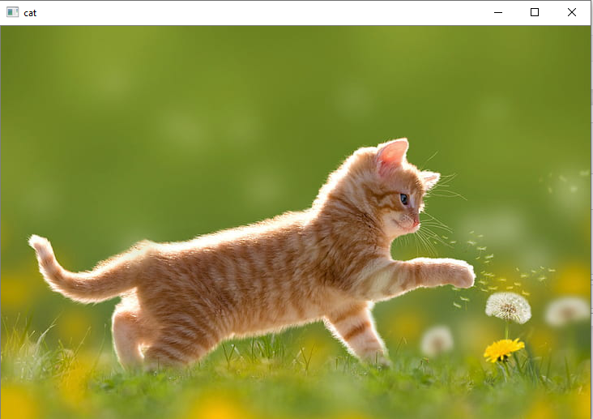
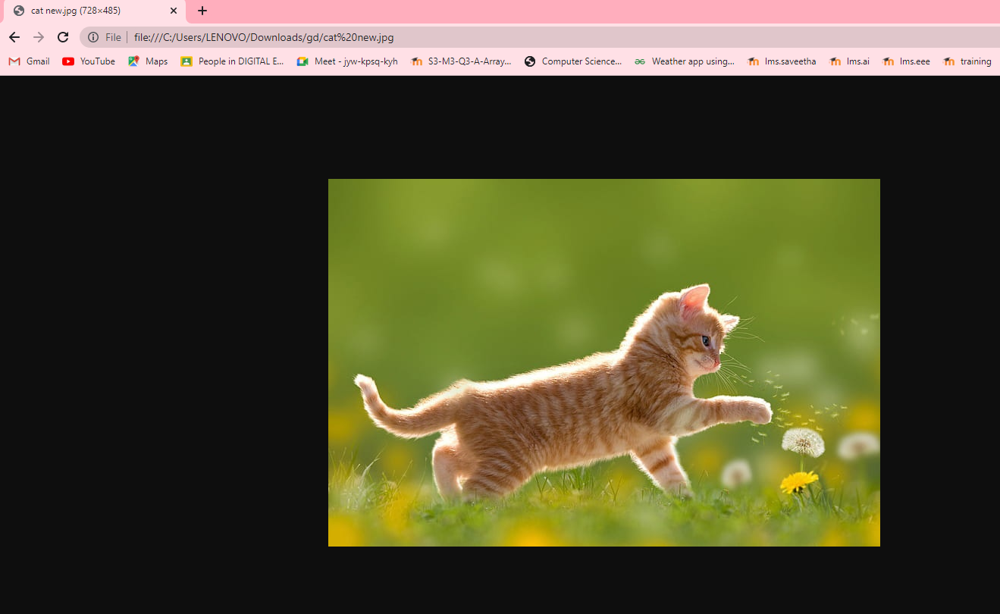
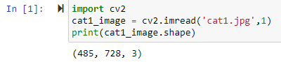
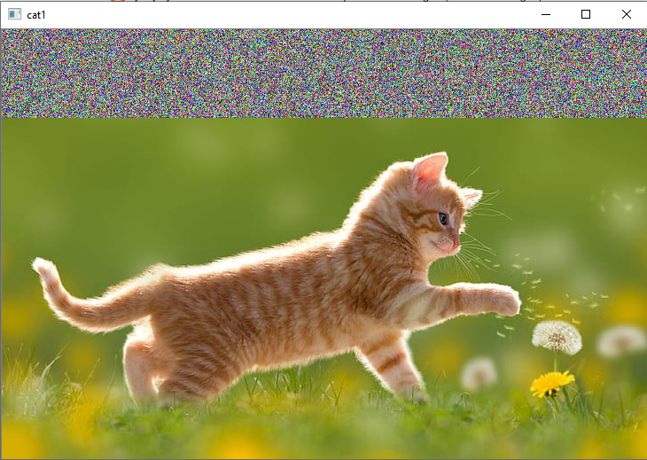
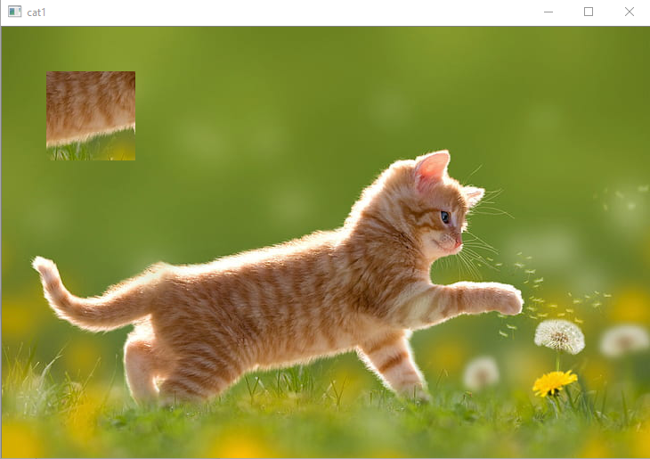

## Ex No:01
## Date:30.0.2022
# <p align="center">  READ AND WRITE AN IMAGE</p>

## AIM
To write a python program using OpenCV to do the following image manipulations.
i) Read, display, and write an image.
ii) Access the rows and columns in an image.
iii) Cut and paste a small portion of the image.

## Software Required:
Anaconda - Python 3.7
## Algorithm:
### Step1:
Choose an image and save it as a filename.jpg
### Step2:
Use imread(filename, flags) to read the file.
### Step3:
Use imshow(window_name, image) to display the image.
### Step4:
Use imwrite(filename, image) to write the image.
### Step5:
End the program and close the output image windows.
<br>
<br>
## Program:
```python
# Developed By:
Durgadevi P

# Register Number:
212220230015

# To Read,display the image
import cv2
cat_img = cv2.imread('cat.jpg',1)
cv2.imshow('cat1',cat_img)
cv2.waitKey(0)
destroyAllWindows()

# To write the image
import cv2
cat_img = cv2.imread('cat.jpg',1)
cv2.imwrite('new image.jpg',cat_img)

# Find the shape of the Image
import cv2
cat_img = cv2.imread('cat.jpg',1)
print(cat_img.shape))

# To access rows and columns
import random
for i in range(100):
    for j in range(cat_img.shape[1]):
       cat_img[i][j] = [random.randint(0,255),random.randint(0,255),random.randint(0,255)]
cv2.imshow('Cat1',cat_img)
cv2.waitKey(0)
destroyAllWindows()

# To cut and paste portion of image
import cv2
cat_img = cv2.imread('cat.jpg',-1)
tag = cat_img[300:400,300:400]
cat_img[50:150,50:150] = tag
cv2.imshow('Cat1',cat_img)
cv2.waitKey(0)
destroyAllWindows()
```
<br>
<br>
<br>

## Output:
### i) Read and display the image

<br>
<br>
<br>
<br>
<br>
<br>
<br>
<br>
<br>
<br>
<br>
<br>
<br>

### ii)Write the image

<br>

### iii)Shape of the Image

<br>

### iv)Access rows and columns

<br>

### v)Cut and paste portion of image

<br>


## Result:
Thus the images are read, displayed, and written successfully using the python program.


